<!--
  Профиль GitHub: @reitar0
  Баннер — это два SVG в папке assets/ (dark.svg + light.svg).
  GitHub сам подставит нужный по теме читателя через <picture> ниже.

  ГДЕ МЕНЯТЬ ТЕКСТ: открой assets/dark.svg и assets/light.svg
  и правь одинаковые строки в обоих файлах (роли, город, вуз, focus,
  email, навыки, ссылки). Подробности — в SETUP.md.
-->

  <picture>
    <source media="(prefers-color-scheme: dark)" srcset="./assets/dark.svg">
    <source media="(prefers-color-scheme: light)" srcset="./assets/light.svg">
    
  </picture>

---

## 👋 About

<!-- ✏️ ЗАМЕНИ строку ниже на свою короткую биографию (1–2 предложения) -->
AI &amp; Fullstack developer. Building things end-to-end — from frontend architecture to autonomous AI agents.

- 🎯 **Focus:** AI Fullstack Solutions · Agents · Automation
- 🎓 **Education:** KCHGU
- 📍 **Based in:** Moscow, RU
- ✉️ **Email:** [asanurireitaro@gmail.com](mailto:asanurireitaro@gmail.com)
- ✈️ **Telegram:** [@asanuri](https://t.me/asanuri)

---

## 🛠️ Tech Stack

